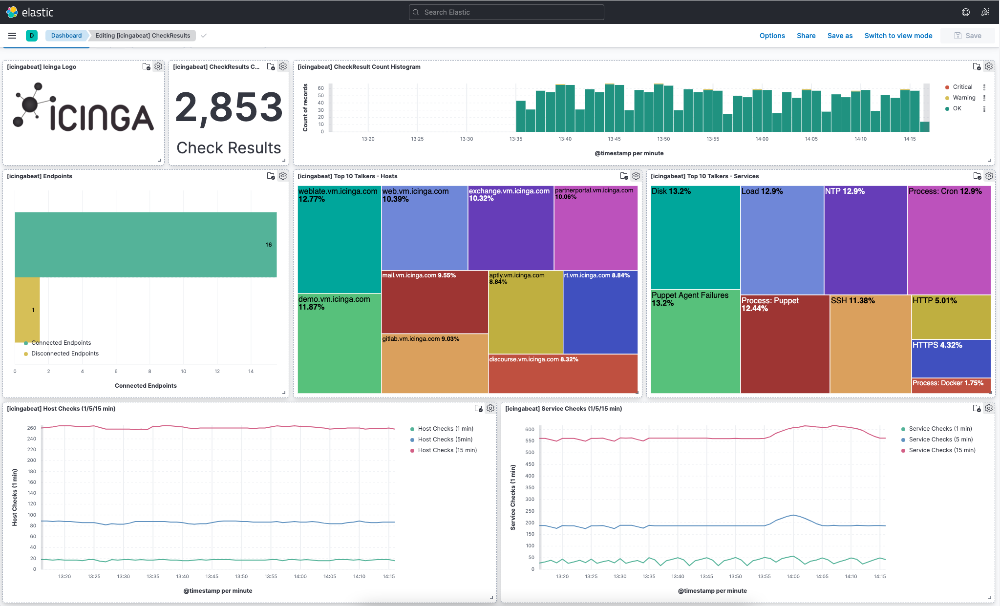

[](https://travis-ci.org/Icinga/icingabeat)

# Icingabeat

> The Beats are lightweight data shippers, written in Go, that you install on
> your servers to capture all sorts of operational data (think of logs,
> metrics, or network packet data). The Beats send the operational data to
> Elasticsearch, either directly or via Logstash, so it can be visualized with
> Kibana.

Icingabeat is an [Elastic Beat](https://www.elastic.co/products/beats) that
fetches data from the Icinga 2 API and sends it either directly to Elasticsearch
or Logstash.



## Documentation
Please read the documentation on
[icinga.com/docs/icingabeat/latest](https://www.icinga.com/docs/icingabeat/latest/)
for more information

## Development

### Building and running manually

#### Requirements

* [Golang](https://golang.org/dl/) 1.16

#### Clone

To clone Icingabeat from the git repository, run the following commands:

```shell
mkdir -p ${GOPATH}/github.com/icinga
cd ${GOPATH}/github.com/icinga
git clone https://github.com/icinga/icingabeat
```

For further development check out the [beat developer guide](https://www.elastic.co/guide/en/beats/libbeat/current/new-beat.html).

#### Build
Ensure that this folder is at the following location:
`${GOPATH}/github.com/icinga`

To build the binary for Icingabeat run the command below. This will generate a
binary in the same directory with the name icingabeat.

```shell
mage build
```

#### Run
To run Icingabeat with debugging output enabled, run:

```shell
./icingabeat -c icingabeat.yml -e -d "*"
```

### Packaging

The beat frameworks provides tools to crosscompile and package your beat for
different platforms. This requires [docker](https://www.docker.com/) and
vendoring as described above. To build packages of your beat, run the following
command:

```shell
export PLATFORMS="linux/amd64 linux/386"
mage package
```

This will fetch and create all images required for the build process. The whole
process can take several minutes to finish.
