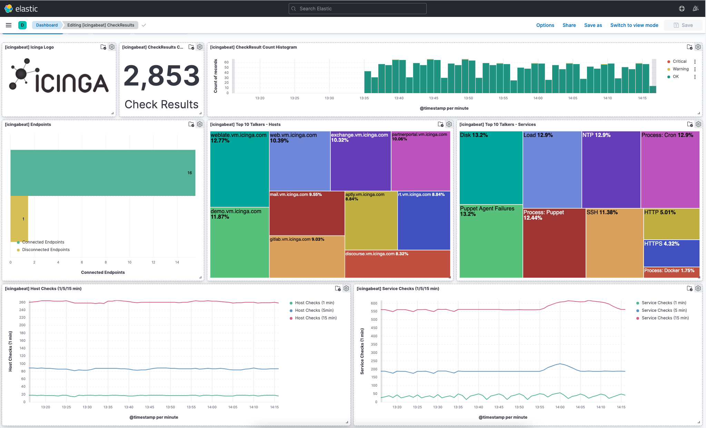
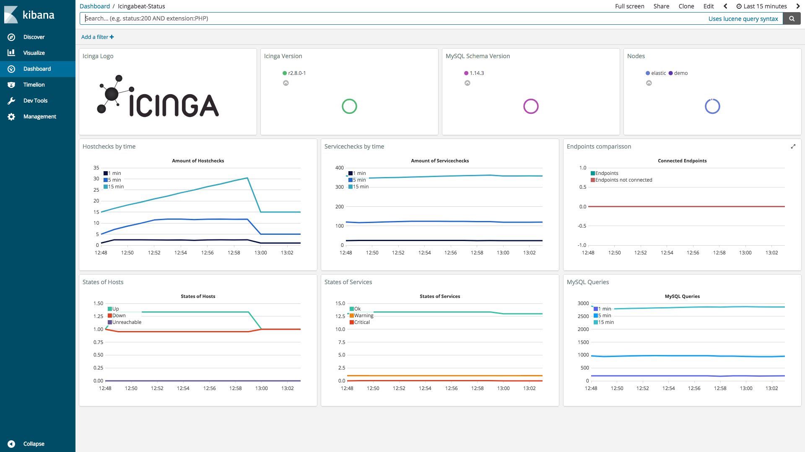

# Icingabeat

Icingabeat is an [Elastic Beat](https://www.elastic.co/products/beats) that
fetches data from the Icinga 2 API and sends it either directly to Elasticsearch
or Logstash.

> The Beats are lightweight data shippers, written in Go, that you install on
> your servers to capture all sorts of operational data (think of logs,
> metrics, or network packet data). The Beats send the operational data to
> Elasticsearch, either directly or via Logstash, so it can be visualized with
> Kibana.

 | 
-------------------------------------------------|-------------------------------------

## Eventstream

Icingabeat listens to an eventstream published by the Icinga 2 API. This stream
includes detailed information about events, such as checkresults, notifications,
downtimes, acknowledgemts and many other event types. There is no polling
involved in this mode. The configuration section describes how to limit the
amount of data you receive by setting types and filters.

Example use cases:
* Correlate monitoring data with logging information
* Retrace notifications sent by Icinga 2
* Find bottlenecks in execution time and latency of service checks

## Statuspoller

The Icinga 2 API exports a lot of information about the state of the Icinga 2
daemon. Icingabeat can poll these information periodically.

Example use cases:
* Visualize metrics of the Icinga 2 daemon
* Get insights how each Icinga 2 feature performs
* Information about zones and endpoints
* Compare Icinga servers with each other
